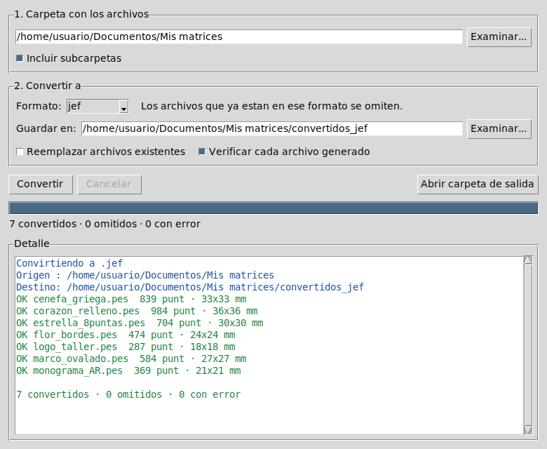

# Portafolio — Automatización de Procesos

📂 [Ver repositorio completo en GitHub](https://github.com/eseekae/portafolio-automatizacion)

Proyectos demo de automatización enfocados en resolver problemas reales de
pequeños negocios y emprendimientos: atención de clientes y generación de
reportes.

## 📁 Proyectos

### 1. Bot de atención automática (Telegram)
[`demo1_bot_faq_telegram.py`](https://github.com/eseekae/portafolio-automatizacion/blob/main/demo1_bot_faq_telegram.py)

Bot que responde preguntas frecuentes de clientes (horario, envíos, precios,
formas de pago) automáticamente, y deriva a un humano cuando no tiene
respuesta. Pensado para negocios chicos que no pueden tener a alguien
respondiendo el chat todo el día.

**Stack:** Python, python-telegram-bot

### 2. Automatización de reportes de ventas
[`demo2_reporte_automatico.py`](https://github.com/eseekae/portafolio-automatizacion/blob/main/demo2_reporte_automatico.py)

Toma un CSV de ventas crudo y genera automáticamente un Excel con 5 hojas
de resumen: totales generales, ventas por producto, por categoría, por
vendedor y evolución diaria. Reemplaza el proceso manual de armar reportes
cada semana.

**Stack:** Python, pandas, openpyxl

**Archivos de ejemplo:**
- [`sample_ventas.csv`](https://github.com/eseekae/portafolio-automatizacion/blob/main/sample_ventas.csv) — datos de entrada de prueba
- [`reporte_ventas.xlsx`](https://github.com/eseekae/portafolio-automatizacion/blob/main/reporte_ventas.xlsx) — resultado generado por el script

### 3. Conversor de matrices de bordado (aplicación de escritorio)
[`bordado/`](https://github.com/eseekae/portafolio-automatizacion/tree/main/bordado)

Programa con ventana para convertir matrices de bordado entre formatos **por
lotes**: eliges una carpeta y pasa todos tus diseños a `.JEF`, `.PES`, `.DST` o
el que necesite tu máquina. Lee 47 formatos y escribe 19. Convertir 40 archivos
toma menos de un segundo.

Pensado para talleres y personas que venden matrices y hoy convierten archivo
por archivo en páginas web.

**[⬇ Descargar para Windows, macOS o Linux](https://github.com/eseekae/portafolio-automatizacion/releases/latest)** ·
[Instrucciones de instalación](https://github.com/eseekae/portafolio-automatizacion/tree/main/bordado#descargar-e-instalar)

Un solo archivo, sin instalador y sin necesidad de tener Python.

También incluye un pipeline para **generar** matrices por código, con control
de calidad automatizado (densidad, puntada mínima, ajuste al aro) y exportación
a los cinco formatos con vista previa y ficha técnica.

**Stack:** Python, pyembroidery, tkinter, PyInstaller, GitHub Actions

## 🛠️ Sobre mí

Estudiante de Ingeniería, Universidad de Chile (FCFM). Disponible para
proyectos freelance de automatización, scripting y desarrollo a medida.

📧 sebastian.2006ramirez@gmail.com
