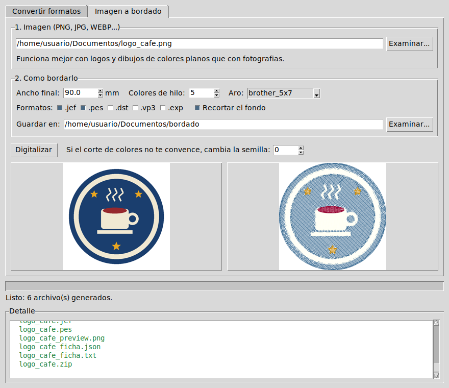
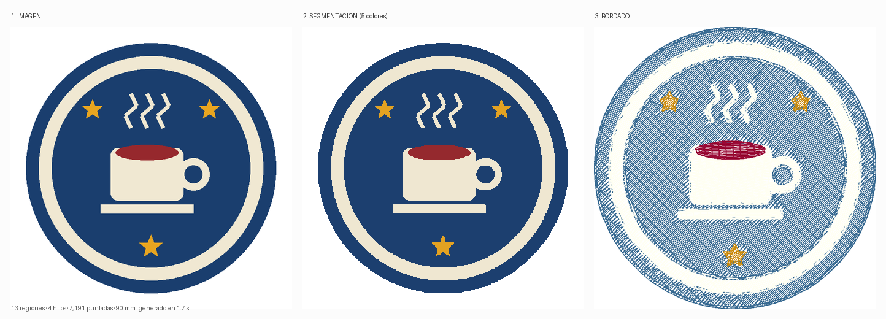
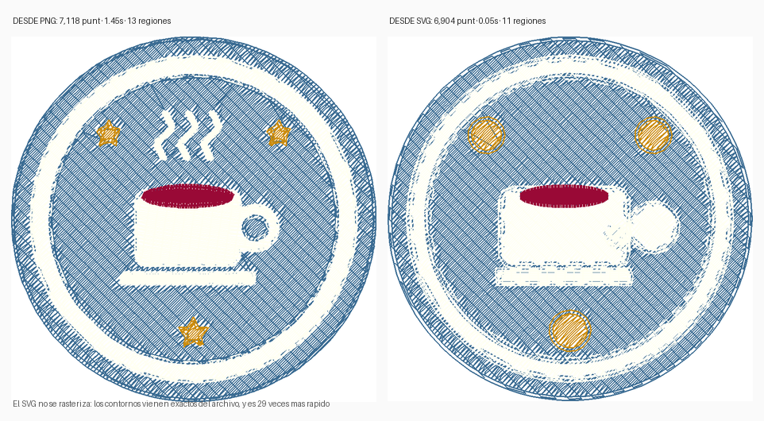
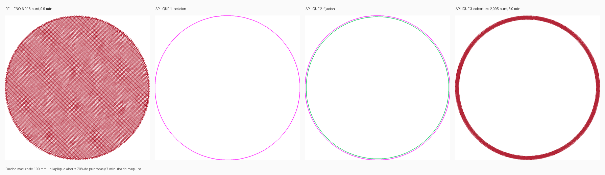

# Conversor de matrices de bordado

[](https://github.com/eseekae/portafolio-automatizacion/actions/workflows/tests.yml)
[](https://github.com/eseekae/portafolio-automatizacion/actions/workflows/ejecutables.yml)

Dos herramientas en un solo programa:

- **Convertir por lotes** — eliges una carpeta y pasa todos tus diseños a
  `.JEF`, `.PES`, `.DST` o el formato que necesite tu máquina. Lee **47
  formatos** y escribe **19**.
- **Imagen a bordado** — le das un PNG o un JPG y genera la matriz: separa los
  colores, traza los contornos, decide cómo coser cada región y elige los hilos.
- **Appliqué** — para áreas grandes, cose sobre un retazo de tela en vez de
  rellenar con hilo: hasta 70% menos puntadas y una pieza flexible.
- **SVG** — si tu arte ya es vectorial, se importa sin rasterizar: contornos
  exactos y 29 veces más rápido.
- **Redimensionar** — cambios chicos con corrección de puntada, y un aviso
  claro cuando el cambio es demasiado grande para hacerse bien.
- **Analizar** — le das cualquier matriz y te dice dónde se va el tiempo y qué
  se puede recortar sin estropearla.

Programa gratis y de código abierto. No necesitas instalar Python ni saber
programar.



---

> ### ⚠️ Si generaste matrices con la versión 0.7.0 o anterior, vuelve a generarlas
>
> Hasta la 0.7.0 los archivos salían **espejados verticalmente**: la máquina
> bordaba el diseño cabeza abajo. No se notaba porque la vista previa y el
> simulador aplicaban un volteo propio, así que en pantalla se veía derecho.
> Corregido en la 0.8.0. Los archivos ya generados **no se arreglan solos**:
> hay que volver a digitalizarlos desde la imagen o el SVG.

# Descargar e instalar

**[⬇ Ir a la página de descargas](https://github.com/eseekae/portafolio-automatizacion/releases/latest)**

Es un solo archivo. No hay instalador, no toca el registro de Windows y no
deja nada en tu sistema: si lo quieres borrar, mandas el archivo a la papelera.

## Windows

1. Descarga **`ConversorBordado.exe`**.
2. Haz doble clic.
3. Aparecerá una pantalla azul que dice **"Windows protegió tu PC"**.
   Es normal: pasa con todo programa que no paga una firma digital (cuestan
   unos US$200 al año). Haz clic en **Más información** → **Ejecutar de todas
   formas**.

Listo. Puedes dejar el `.exe` en el Escritorio o donde te acomode.

## macOS

1. Descarga **`ConversorBordado-macos.zip`** y descomprímelo (doble clic).
2. **Haz clic derecho** sobre `ConversorBordado.app` → **Abrir** → **Abrir**.

> Importante: la primera vez tiene que ser **clic derecho → Abrir**. Con doble
> clic normal, macOS lo bloquea sin dar opción. Si igual aparece "no se pudo
> verificar", ve a **Ajustes del Sistema → Privacidad y seguridad**, baja hasta
> el aviso y pulsa **Abrir igualmente**.

## Linux

Descarga **`ConversorBordado-linux`** y dale permiso de ejecución:

```bash
chmod +x ConversorBordado-linux
./ConversorBordado-linux
```

---

# Cómo se usa

1. **Elige la carpeta.** Botón *Examinar...*, seleccionas dónde tienes tus
   diseños. Marca *Incluir subcarpetas* si están repartidos en varias.
2. **Elige el formato.** `jef` para Janome, `pes` para Brother o Babylock,
   `dst` para máquinas industriales.
3. **Pulsa Convertir.**

Los archivos nuevos se guardan en una carpeta aparte (`convertidos_jef`), así
que **tus originales no se tocan nunca**. Al terminar, el botón *Abrir carpeta
de salida* te lleva directo a ellos.

Vas a ver una línea por archivo con su cantidad de puntadas y su tamaño en
milímetros:

| Marca | Significa |
|:---:|---|
| `OK` | Convertido y verificado |
| `--` | Omitido (ya estaba en ese formato, o ya existía) |
| `XX` | El archivo está dañado y no se pudo leer |

# Convertir una imagen en bordado

Pestaña **Imagen a bordado**.

1. **Elige la imagen.** PNG, JPG, WEBP, BMP — **o un SVG**.
2. **Di de qué tamaño la quieres** (ancho en milímetros) y **cuántos hilos**
   estás dispuesto a usar.
3. **Pulsa Digitalizar.** Te muestra el antes y el después, y deja los
   archivos listos junto con la lista de hilos a comprar.



## Si tienes el SVG, úsalo

Un SVG no se rasteriza: los contornos salen exactos del archivo y los colores
ya son planos. No hay que elegir cuántos hilos ni ajustar la semilla.



Sirve cualquier SVG de Inkscape, Illustrator o Figma. Dos cosas antes de
exportar:

- **Convierte el texto a curvas.** Un `<text>` sin convertir se ignora.
- **Los degradados no se bordan.** Cada color es un carrete; conviértelos a
  colores planos.

**Los contornos (`stroke`) sí se bordan.** En un logo, el contorno blanco de
un escudo o el marco de una cinta casi nunca es un relleno: es un trazo. Se
cosen según su grosor — con **satén** si el trazo tiene cuerpo, con **corrida
triple** si es una línea fina — respetando el ancho que dice el archivo, con
las transformaciones aplicadas.

> Hasta la 0.8.0 el importador leía solo `fill` y se saltaba `stroke` por
> completo: esas piezas no llegaban al bordado y no había forma de
> recuperarlas.

## Qué esperar, con honestidad

**Funciona bien** con logos, íconos y dibujos de colores planos — que es
justo lo que se borda.

**Funciona mal** con fotografías, degradados y sombras. El bordado no tiene
degradados: cada color es un carrete. Una foto hay que simplificarla a mano
antes.

**No reemplaza a un digitalizador profesional.** Te deja un punto de partida
muy avanzado en segundos; un trabajo de venta suele querer retoques.

Tres cosas que sí hace bien y que la mayoría de los automáticos baratos no:

- **Respeta los huecos.** El centro de una letra "o", el asa de una taza o un
  anillo quedan vacíos, no rellenos.
- **Distingue el blanco del fondo del blanco del dibujo.** El fondo se quita
  rellenando desde el borde hacia adentro, no borrando ese color en toda la
  imagen. En un escudo blanco sobre fondo blanco las dos cosas son del mismo
  color y son cosas distintas: lo de afuera no se borda, el monograma de
  adentro **sí** — es hilo blanco, que sobre una prenda de color es justo lo
  que se ve.
- **Borda el detalle fino en vez de tirarlo.** Un trazo de medio milímetro
  —el año de un escudo, un contorno delgado, la contra de una letra— no se
  puede *rellenar*: no cabe la puntada. Pero sí se puede *bordar*, con una
  corrida de puntadas sobre el trazo, que es como lo hace cualquier
  digitalizador profesional. El hilo mide unos 0,4 mm de ancho, así que una
  línea de hilo **es** el trazo. Solo se descarta lo que ya no es dibujo sino
  el halo difuso que deja reducir la imagen (por debajo de 0,25 mm).
- **Te dice qué hilos comprar.** Elige de la paleta real de tu máquina, con
  nombre y número, y avisa cuándo el color es solo aproximado.

## Elegir qué partes se bordan

Un logo trae piezas que no siempre quieres: un contorno, una sombra, un texto
que a ese tamaño no se va a leer. Después de digitalizar aparece la lista de
**piezas detectadas**, cada una con su color de hilo, su técnica y su tamaño.
Desmarca las que no quieras y pulsa **Rehacer con lo marcado**.

Es instantáneo: analizar la imagen es lo caro y ya está hecho; rehacer las
puntadas no cuesta nada. Puedes probar combinaciones sin esperar.

Atajos: **Todo**, **Nada** y **Sin el detalle fino** (deja solo las piezas
que se rellenan de verdad). Desde la terminal:

```bash
matriz digitalizar logo.png --ancho 90 --sin-detalle-fino
```

## Cómo se bordan las letras y los números chicos

Un número de 4 mm tiene trazos de medio milímetro. La puntada más corta que
admite una máquina es de 0,7 mm. Parece imposible — y con las dos técnicas
obvias lo es:

- **Recorrer el contorno** del número: la puntada y el avance son la misma
  cosa, así que hay que muestrear el contorno cada 0,7 mm y un dígito de 2 mm
  de ancho queda reducido a doce puntos. Sale un garabato.
- **Rellenarlo con trama**: los giros de fin de fila caen a 0,35 mm y el
  filtro de puntadas cortas los borra.

**Las dos se probaron y las dos fallan.** Lo que funciona es lo que usa la
industria: la **columna satén**.

En una columna satén dos perforaciones seguidas caen en lados **opuestos** del
trazo. La puntada mide el *ancho* del trazo —0,7 mm, legal— mientras que el
avance a lo largo del trazo es de solo 0,35 mm. Es decir, la columna satén
**desacopla el largo de la puntada de la resolución del dibujo**, y por eso se
puede bordar detalle más fino que la propia puntada mínima.

Para armar la columna hacen falta los dos bordes del trazo, y para eso hay que
saber por dónde pasa: su **eje medial**. `imagen/esqueleto.py` lo calcula
—rasteriza, adelgaza con Zhang-Suen, mide la distancia al borde y corta el
esqueleto en ramas— y cada rama se cose como su propia columna.

Medido sobre `1813` en DejaVu Sans Bold:

| Altura del dígito | Resultado |
|---|---|
| 4,8 mm | se lee limpio |
| 3,4 mm | se lee, con los trazos ya juntos |
| 2,7 mm y menos | los trazos se tocan y el número se pierde |

Ese límite de ~4 mm es el mismo que manejan los digitalizadores
profesionales, y es del **hilo**: 0,4 mm de ancho no caben tres veces dentro
de una letra de 2,5 mm. El programa te avisa cuándo una pieza baja de ahí.

Si tu logo trae texto por debajo del límite:

1. **Agranda el diseño.** Es lo que de verdad lo resuelve.
2. **Desmarca esas piezas** y borda el resto limpio.
3. Borda el texto aparte, más grande, como una segunda pieza.

# Appliqué: bordar sobre tela en vez de rellenar

Rellenar un parche grande con hilo es lento y deja la tela acartonada. El
appliqué recorta un retazo del color que quieras y cose **solo los bordes**.



Marca **Usar appliqué en las áreas grandes** y el programa decide solo dónde
conviene. No es un umbral por tamaño: compara los dos costos y solo lo propone
cuando ahorra de verdad.

| Diámetro del parche | Relleno | Appliqué | Decisión |
|---|---:|---:|---|
| 25 mm | 394 punt | 519 punt | rellenar |
| 40 mm | 966 punt | 831 punt | rellenar (ahorra poco) |
| 60 mm | 2 123 punt | 1 246 punt | **appliqué** |
| 100 mm | 5 869 punt | 2 199 punt | **appliqué** |

Un anillo delgado **no** se aplica aunque sea grande: tiene tanto borde que la
cobertura costaría más que el relleno que evita.

## Cómo se borda un appliqué

La máquina se detiene entre pasos, como si pidiera un cambio de color. **No
cambies el hilo**: la parada está ahí para que trabajes la tela.

1. **Posición** — cose una guía sobre la tela base y se detiene. Pon el retazo
   encima, cubriendo la línea.
2. **Fijación** — sujeta el retazo y se detiene. Recorta la tela sobrante al
   ras de la costura, con tijera curva.
3. **Cobertura** — una columna satin tapa el borde recortado. Es el único paso
   que se ve en la pieza terminada.

La ficha técnica que se genera trae estas instrucciones junto al archivo.

> **Por qué los pasos salen de colores distintos:** es lo que obliga a la
> máquina a detenerse. El programa verifica, formato por formato, que las
> paradas sobrevivieron al guardar — si una se pierde, la máquina cosería los
> tres pasos de corrido y arruinaría la pieza, así que eso es un error y no
> se exporta.

## Si el resultado no te convence

| Problema | Qué mover |
|---|---|
| Se perdió un detalle de color | Sube **Colores de hilo** |
| Salieron manchas sueltas feas | Baja **Colores de hilo** |
| El corte de colores quedó raro | Cambia la **semilla** y vuelve a probar |
| Se bordó el fondo | Marca **Recortar el fondo** |
| Un área grande tarda demasiado | Marca **Usar appliqué** |

# Cambiar el tamaño de una matriz

En la pestaña **Convertir formatos** hay un campo **Redimensionar a %**.

**Solo admite cambios de hasta ±12%, y eso es una limitación física, no del
programa.** Un archivo de bordado guarda puntadas, no formas. Al escalarlo, la
separación entre pasadas del relleno se multiplica por el mismo factor:

| Cambio | Separación | Resultado |
|---|---|---|
| −50% | 0.40 → 0.20 mm | agarrota la tela y rompe agujas |
| −10% | 0.40 → 0.36 mm | correcto |
| +10% | 0.40 → 0.44 mm | correcto |
| +50% | 0.40 → 0.60 mm | se ve la tela entre pasadas |

Dentro del rango, además de escalar se **corrigen los largos de puntada**: al
agrandar aparecen puntadas que se enganchan y al achicar otras que rompen
agujas. Esas sí se recalculan, porque solo dependen de dos puntos.

**Para cambios grandes hay una sola forma correcta: re-digitalizar el
original.** Vuelve a la pestaña *Imagen a bordado* con la imagen o el SVG y
pon el ancho que quieras. Ahí las regiones todavía existen y la densidad se
calcula de nuevo desde cero.

El programa no te deja pasarte en silencio: rechaza el archivo y te dice por
qué.

# ¿Por qué mi matriz tarda tanto?

Antes de tocar nada, mídela:

```bash
matriz analizar dragon.pes --velocidad 500
```

```
  Puntadas.......................... 12,400
  Superficie cubierta (cm2)......... 62.0
  Densidad (puntadas/cm2)........... 200
  Hilo (m).......................... 34.8
  Cortes de hilo.................... 180
  Saltos (aguja en vacio)........... 240  ·  190 cm de recorrido
--------------------------------------------------------------
 TIEMPO ESTIMADO
  Cosiendo..........................  24.8 min
  Cortes de hilo....................   4.5 min
  TOTAL.............................  29.3 min
```

Pon la velocidad **de tu máquina** (`--velocidad`, en puntadas por minuto; las
domésticas van entre 400 y 850). El total incluye los cortes de hilo, que
detienen la máquina ~1,5 s cada uno — contar solo puntadas siempre subestima.

## Si la máquina se detiene todo el rato

Un diseño de un solo color **no debería detener la máquina nunca**. Si lo hace,
son **cortes de hilo**, no pausas: cada corte para el cabezal ~1,5 s, y en
máquinas sin cortador automático te obliga a intervenir.

Los cortes salen de que la aguja tenga que **viajar lejos** entre una zona y
otra. Hay dos cosas que lo evitan.

**1. Ordenar las corridas.** El programa las ordena por cercanía y puede darlas
vuelta, porque una costura se puede hacer en cualquiera de los dos sentidos.
Eso no cambia ni una puntada, solo en qué secuencia se cosen. Sobre el diseño
de prueba:

| | Antes | Ahora |
|---|---:|---:|
| Cortes de hilo | 17 | **8** |
| Recorrido en vacío | 80 cm | **47 cm** |
| Puntadas | 2 934 | 2 934 *(idénticas)* |

**2. Enlazar en vez de saltar.** Éste era el error que se veía en la máquina:
terminaba una zona, **cortaba el hilo, volvía al origen y se movía al lado**
para seguir bordando… a 2 mm de donde estaba. Cortar para recorrer 2 mm no
tiene sentido: sale más barato **seguir cosiendo** hasta allá.

Ahora la transición entre dos costuras se decide por la distancia:

| Distancia | Qué hace la máquina | Costo |
|---|---|---|
| ≤ 5 mm (`enlace_max_mm`) | **cose** hasta el punto siguiente | 1-2 puntadas, sin parar |
| 5 – 12 mm | salta con la aguja arriba | deja un hilo suelto |
| > 12 mm (`salto_max_sin_corte_mm`) | remata y **corta** | ~1,5 s de máquina |

Medido sobre un diseño de un color con mucho detalle fino (un cuerpo relleno
más 24 piezas chicas de satín, que es justo el caso donde se notaba):

| | Sin enlace | Con enlace |
|---|---:|---:|
| Saltos de aguja | 51 | **26** |
| Recorrido en vacío | 32,3 cm | **30,4 cm** |
| Puntadas | 2 552 | 2 528 |

Los saltos caen a la mitad y las puntadas incluso bajan, porque el remate y la
entrada que exigía cada corte desaparecen. En diseños de manchas grandes y
separadas el efecto es menor: ahí los saltos son largos de verdad y cortar
sigue siendo lo correcto.

El selector **Calidad** también decide cuándo cortar y cuándo saltar:

| Perfil | Corta si el salto pasa de | Resultado |
|---|---|---|
| `alta` | 8 mm | menos hilo suelto, más paradas |
| `equilibrada` | 12 mm | equilibrio |
| `rapida` | 18 mm | la mitad de paradas, algún hilo que recortar |

Un salto no detiene la máquina, pero deja un hilo cruzando la tela. Las
máquinas de la última década lo cortan solas; las viejas te dejan el hilo para
que lo recortes.

## Las tres palancas

Medidas sobre un relleno de 45 cm²:

| Cambio | Ahorro | Qué se nota |
|---|---:|---|
| Separación 0.40 → 0.45 mm | 9% | nada en áreas grandes |
| Puntada 3.5 → 4.0 mm | 10% | nada en áreas grandes |
| Menos underlay | 14% | algo en telas elásticas |
| **Las tres juntas** | **32%** | poco, salvo en detalles finos |

Eso es el selector **Calidad** de la pestaña *Imagen a bordado*:

| Perfil | Separación | Puntada | Tiempo |
|---|---|---|---|
| `alta` | 0.38 mm | 3.2 mm | +8% |
| `equilibrada` | 0.40 mm | 3.5 mm | referencia |
| `rapida` | 0.45 mm | 4.0 mm | −20% |

```bash
matriz digitalizar logo.png --ancho 90 --calidad rapida
```

**Y la palanca grande, que no es una palanca:** si el diseño tiene manchas
grandes de un color, el appliqué ahorra 60-70%, no 10%. Las tres de arriba
juntas no llegan a eso.

> **Nada de esto se puede aplicar sobre un archivo ya bordado.** Un `.pes` no
> guarda las regiones, solo las perforaciones. `analizar` te dice qué cambiar;
> aplicarlo exige volver al original y re-digitalizarlo.

## Preguntas frecuentes

**¿Modifica o borra mis archivos originales?**
No. Solo lee. Todo lo nuevo va a una carpeta aparte.

**¿Puedo agrandar o achicar un diseño?**
Hasta ±12%, sí, y el programa corrige los largos de puntada. Más que eso no,
y ningún conversor debería prometerlo: un archivo de bordado guarda *puntadas*,
no formas. Para cambios grandes hay que re-digitalizar el original. Ver
[Cambiar el tamaño](#cambiar-el-tamaño-de-una-matriz).

**Mi antivirus lo marca como sospechoso.**
Pasa con casi todos los programas empaquetados de esta forma; es un falso
positivo conocido. El código completo está en este repositorio y los
ejecutables se generan automáticamente desde él, a la vista de todos.

**¿Qué formato usa mi máquina?**

| Formato | Máquinas |
|---|---|
| `.jef` | Janome |
| `.pes` | Brother, Babylock, Bernina |
| `.vp3` | Husqvarna Viking, Pfaff |
| `.dst` | Industriales (Tajima y la mayoría) |
| `.exp` | Melco, Bernina |
| `.xxx` | Singer |

**¿Se pierden los colores?**
No, salvo en `.dst` y `.exp`, que por diseño no guardan color adentro. Para
esos el programa genera un archivo de paleta al lado (`.edr` / `.inf`) para
que no pierdas la secuencia de hilos.

**¿Funciona sin internet?** Sí, todo se procesa en tu computador. No se sube
ninguna imagen a ningún servidor.

**¿La digitalización usa inteligencia artificial?**
No, y es a propósito. Usa algoritmos deterministas: agrupamiento de color en
espacio Lab, trazado de contornos y reglas de digitalización. La ventaja es
que con la misma imagen y la misma semilla siempre obtienes el mismo archivo,
funciona sin conexión y no tiene costo por uso ni límites.

---

# Ver cómo la máquina va a bordar (antes de bordar)

Un archivo de bordado es una lista de perforaciones: leerlo no dice nada,
**verlo coserse lo dice todo**. El simulador reproduce la matriz puntada a
puntada en el navegador.

Desde el programa: después de digitalizar una imagen aparece el botón
**«Ver cómo lo borda la máquina»**.

Desde la terminal:

```bash
matriz simular dragon.pes
# escribe dragon_simulacion.html — ábrelo con doble clic
```

**Qué se ve**

- **Todo el diseño en una pantalla**, sin scrollear: el lienzo se ajusta al
  hueco que queda en la ventana, tanto en el computador como en el teléfono.
  Para mirar de cerca, rueda del ratón o pellizco; para moverte, arrastra.
  El botón **Ajustar a la pantalla** devuelve el encuadre completo.
- La aguja avanzando, con reproducción, pausa, retroceso y 4 velocidades.
- La barra para **ir a una puntada exacta**: si sospechas de una zona, te
  paras justo ahí.
- Los **saltos** en gris punteado y los **cortes de hilo** con una X roja.
  Ahí se ve de un vistazo si la máquina está cortando al lado de donde
  estaba.
- Los **problemas** marcados con un punto: puntadas bajo 0,6 mm (la máquina
  puede saltárselas o romper la aguja), puntadas sobre 12,1 mm (el formato no
  las puede representar) y saltos largos (hilo cruzando la pieza).
- El panel **Revisión** con el recuento de cada cosa.

**Para qué sirve de verdad**

| Falla | Cómo se ve |
|---|---|
| Recorrido malo | la aguja va y viene de un extremo al otro |
| Cortes de más | X rojas seguidas en la misma zona |
| Hilos cruzando | líneas punteadas largas sobre el diseño |
| Zonas cosidas dos veces | el mismo tramo se repinta |
| Orden de colores | qué color tapa a cuál |

- **El color de la tela.** Ocho atajos (blanco, negro, gris, azul marino,
  burdeo, verde, crudo, rojo) y un selector para cualquier color. Sobre fondo
  blanco un hilo blanco es invisible y no hay forma de revisarlo; y un diseño
  para polera negra se ve distinto de lo que va a ser.
- **Lo que ves es el archivo, sin maquillaje.** El simulador no endereza ni
  corrige nada: dibuja las coordenadas tal como están escritas. Si el archivo
  sale torcido, se ve torcido — que para eso es un simulador. Un visor que
  arregla las cosas por su cuenta es justamente cómo pasó inadvertido, durante
  seis versiones, que las matrices salían espejadas.

El HTML es **autónomo**: no necesita internet, ni tener el programa instalado.
Se lo puedes mandar por correo o WhatsApp a un cliente para que apruebe el
diseño antes de que gastes hilo y tela.

---
---

# Para desarrolladores

Lo de arriba es el programa terminado. De aquí en adelante, el proyecto.

## Instalación desde el código

```bash
pip install -e .          # deja disponibles `matriz` y `matriz-gui`
pytest -q
```

## Conversor por línea de comandos

```bash
# 40 archivos .pes a .jef con un comando, replicando la estructura de carpetas
matriz convertir catalogo/ -r --a jef -o convertidos/

matriz convertir *.pes --a jef          # comodines o archivos sueltos
matriz convertir catalogo/ --a dst --seco   # simulación, no escribe nada
matriz formatos                          # formatos soportados
```

| Opción | Qué hace |
|---|---|
| `-r` | incluye subcarpetas |
| `-o DIR` | carpeta de destino (por defecto, junto al original) |
| `--plano` | vuelca todo en una carpeta; avisa si hay nombres que colisionan |
| `--sobrescribir` | reemplaza archivos existentes (por defecto los omite) |
| `--escala N` | redimensiona al N% (rango seguro: 88–112) |
| `--forzar-escala` | acepta una escala fuera del rango seguro |
| `--seco` | simulación |
| `--sin-verificar` | omite la relectura de control |
| `--version-pes {1,6}` | v1 = máxima compatibilidad con Brother antiguas |

**Lo que lo diferencia de un conversor cualquiera:**

- **Verifica lo que escribe.** Relee cada archivo generado y compara puntadas
  y dimensiones contra el original. Un binario corrupto pesa igual que uno
  bueno y no se queja hasta que la máquina lo rechaza.
- **Aísla los errores.** Un archivo corrupto entre 40 no bota el lote.
- **No pierde los colores.** `.dst`, `.exp` y `.u01` no guardan color en el
  binario: el conversor emite el `.edr` / `.inf` acompañante.
- **No pisa nada en silencio.** Detecta colisiones de nombre y nunca escribe
  sobre el archivo de origen.

## Auto-digitalización por línea de comandos

```bash
matriz digitalizar logo.png --ancho 90 --colores 5 --a jef pes -o salida/
matriz digitalizar logo.svg --ancho 90                # vectorial, sin rasterizar
matriz digitalizar logo.png --ancho 60 --ver-segmentacion   # imagen de control
matriz convertir catalogo/ --a jef --escala 110       # convertir y redimensionar
matriz analizar dragon.pes --velocidad 500           # dónde se va el tiempo
```

| Opción | Qué hace |
|---|---|
| `--ancho MM` | ancho final del bordado (obligatorio) |
| `--colores N` | cantidad de hilos (por defecto 5) |
| `--a FORMATO...` | uno o varios formatos de salida |
| `--aro` | aro objetivo para el control de calidad |
| `--densidad MM` | separación entre pasadas (0.35–0.45) |
| `--detalle PX/MM` | resolución de trabajo (por defecto 8) |
| `--area-min MM2` | descarta regiones menores a esta área |
| `--semilla N` | cambia el corte de colores |
| `--con-fondo` | borda también el fondo |
| `--calidad {alta,equilibrada,rapida}` | acabado contra tiempo de máquina |
| `--aplique` | usa appliqué donde ahorre puntadas |
| `--ancho-cobertura MM` | ancho del satin que tapa el borde del retazo |

### Cómo funciona

```
imagen
  -> segmentar   k-means en espacio Lab           segmentar.py
  -> vectorizar  máscara -> anillos + RDP         vectorizar.py
  -> decidir     tipo de puntada y ángulo         digitalizar.py
  -> ordenar     colores y recorrido              digitalizar.py
  -> hilos       color -> carrete real            hilos.py
  -> patrón      Builder -> EmbPattern            patron.py
```

Decisiones que vale la pena conocer:

- **Agrupamiento en Lab, no en RGB.** RGB no es perceptualmente uniforme:
  agrupar ahí junta colores que el ojo distingue y separa colores que ve
  iguales.
- **Trazado de contornos propio, sin OpenCV.** Sobre máscaras binarias el
  borde es un polígono rectilíneo exacto; resolverlo a mano cuesta 200 líneas
  y ahorra ~60 MB en el ejecutable. Verificado contra figuras de área
  conocida: un cuadrado da su área exacta.
- **Descomposición en celdas (boustrophedon)** para el relleno. Un barrido
  ingenuo corta el hilo cada vez que una fila viene partida: en un anillo son
  91 cortes. La descomposición correcta da 2.
- **El grosor decide.** `2·area/perímetro` da el ancho típico de una región
  sin calcular el eje medial. Por debajo de 0.9 mm no cabe puntada.
- **Eje principal por PCA.** Una región alargada se rellena a lo largo de su
  eje; una compacta, a 45°.
- **Los hilos salen de las paletas reales** que trae pyembroidery (Janome,
  Brother, Husqvarna), con nombre y número de catálogo. No se inventan códigos.
- **Satin automático por doble barrido.** Una franja tiene dos lados largos y
  dos tapas; encontradas las tapas, los lados *son* los rieles del satin. Las
  tapas se hallan con `A = punto más lejano del centroide`, `B = más lejano de
  A` — más robusto que el eje principal cuando la franja viene curvada. Los
  extremos se recortan donde la columna baja de 0.8 mm, porque ahí no cabe
  puntada.
- **El appliqué se decide comparando costos**, no por área: el relleno crece
  con la superficie y el appliqué con el perímetro. Un anillo tiene mucho
  perímetro para poca superficie y por eso no se aplica.
- **El SVG se lee respetando el modelo del pintor.** Las formas se apilan: lo
  posterior tapa lo anterior. A cada forma se le restan las posteriores que
  caen *completamente* dentro, así cada milímetro se cose una sola vez. Solo
  se restan las contenidas de forma inmediata: con A ⊃ B ⊃ C, restarle C a A
  volvería a rellenar ese hueco por la regla par-impar.
- **El redimensionado corrige lo que se puede y rechaza lo que no.** El largo
  de puntada depende de dos puntos y se recalcula exacto; la separación entre
  pasadas depende de las regiones, que un archivo de puntadas ya no tiene.
- **Las corridas se ordenan por cercanía, con la aguja donde está de verdad.**
  Ordenar por el centro de cada región supone dónde terminará la costura, y en
  formas alargadas esa suposición se equivoca por centímetros. Solo se reordena
  dentro de cada fase: el underlay tiene que coserse antes del relleno que
  sostiene.
- **El tiempo se estima con cortes y cambios de color, no solo con puntadas.**
  Cada corte detiene la máquina ~1,5 s y cada cambio de color son ~25 s de
  reenhebrado. En un diseño picoteado eso son minutos.
- **La densidad se informa en puntadas/cm², no en separación entre pasadas.**
  Se probaron varios estimadores de la separación a partir de las puntadas y
  todos fallaban por más del doble según el desfase de filas del relleno. Se
  descartó publicar un número que llevaría a decidir mal. Las bandas de
  puntadas/cm² están calibradas midiendo rellenos de separación conocida sobre
  un disco de área conocida.

## Generar el ejecutable

```bash
pip install -e ".[build]"
pyinstaller empaquetar/conversor.spec --noconfirm   # queda en dist/
```

> **PyInstaller no compila de forma cruzada.** Empaqueta el intérprete nativo
> de la máquina donde corre, así que un `.exe` de Windows tiene que generarse
> en Windows. Por eso `.github/workflows/ejecutables.yml` construye los tres
> en runners separados.

**Publicar una versión** (deja los binarios en la página de descargas). Dos
formas, la primera sin usar git:

1. Pestaña **Actions → Ejecutables → Run workflow**, escribes la versión
   (`v0.2.0`) y le das a correr. El workflow compila los tres sistemas, crea
   la etiqueta y publica la Release.
2. O con git, si prefieres:

   ```bash
   git tag v0.2.0 && git push origin v0.2.0
   ```

Si dejas el campo de versión vacío, solo compila y deja los ejecutables como
artefactos, sin publicar nada.

Sin empaquetar, la misma ventana se abre con `matriz-gui` o
`python -m bordado.gui`.

## Generación de diseños

```bash
python disenos/demo_emblema.py
```

Genera una matriz por código, la valida y la exporta a los cinco formatos con
vista previa y ficha técnica.

## Arquitectura

Capas con dependencia en un solo sentido. La capa de dominio no conoce
formatos de archivo; solo `patron.py` toca pyembroidery.

```
gui/app.py          ventana tkinter: solo widgets y presentación
gui/controlador.py  hilo trabajador + cola de eventos (testeable sin pantalla)
cli.py              subcomandos: convertir · digitalizar · analizar · simular · formatos
convertir.py        motor de conversión por lotes (puro, sin I/O de consola)

imagen/segmentar.py   imagen -> regiones planas de color (k-means en Lab)
imagen/vectorizar.py  máscara -> anillos poligonales + simplificación
imagen/svg.py         SVG -> regiones, sin pasar por píxeles
redimensionar.py      escalado con corrección de largos y límite seguro
analizar.py           mide una matriz: hilo, densidad, tiempo real, palancas
imagen/hilos.py       color -> hilo real del catálogo de la máquina
imagen/esqueleto.py   figura -> sus trazos (eje medial + ancho): letras chicas
imagen/digitalizar.py orquesta las etapas y decide cómo coser cada región

disenos/*.py        definición del diseño (geometría + colores + orden)
     |
puntadas.py         STRATEGY: geometría -> corridas de puntadas
     |                 · puntada_recta / puntada_triple
     |                 · columna_satin  (bordes, letras)
     |                 · relleno_tatami (áreas)
     |
geometria.py        matemática pura en mm, sin dependencias externas
parametros.py       value objects inmutables (densidad, aro, compensación)
     |
patron.py           BUILDER: corridas -> EmbPattern
     |                 orden de colores · enlace / JUMP / TRIM · remates
     |                 filtro de puntadas cortas (restricción física)
     |
validador.py        QA sobre el patrón ya codificado -> Reporte.ok
simular.py          EmbPattern -> guión de trazos -> HTML autónomo
exportar.py         PES/JEF/DST/EXP/VP3 + preview PNG + ficha + ZIP
```

**Convención de unidades:** todo el dominio trabaja en **milímetros** (float).
La conversión a unidades de máquina (1/10 mm) ocurre solo en `patron.py`.

**Eje Y:** el dominio trabaja con Y hacia **arriba** (como en matemáticas);
pyembroidery y los formatos de imagen, hacia **abajo**. El signo se cambia en
exactamente dos sitios, uno por sentido: al **entrar** (`imagen/segmentar.py`
y `imagen/svg.py`, que leen archivos con Y hacia abajo) y al **salir**
(`patron._u`, la única frontera de mm a unidades de máquina). Nadie más lo
toca: ni la preview, ni el simulador.

> Hasta la 0.7.0 el cambio de salida **no existía** y todos los archivos
> salían espejados. La preview y el simulador lo compensaban con un volteo
> propio, así que en pantalla todo se veía bien mientras la máquina bordaba al
> revés. Si la preview vuelve a salir invertida, el error está en `patron._u`
> — se arregla en la frontera, nunca con un segundo volteo.

**Transición entre corridas** (`patron.py`), decidida por la distancia: hasta
`enlace_max_mm` se llega **cosiendo**, hasta `salto_max_sin_corte_mm` se salta
con la aguja arriba, y más allá se remata y se **corta**. Cortar para recorrer
2 mm era el origen de las paradas que se veían en la máquina.

**Hilos:** tkinter no es thread-safe. El lote corre en un hilo trabajador que
publica eventos en una cola; el hilo de la interfaz la vacía cada 80 ms. Por
eso `gui/controlador.py` no importa tkinter y se puede testear sin pantalla.

## Parámetros clave (valores de industria, poliéster 40wt / aguja 75-11)

| Parámetro | Rango | Efecto si te equivocas |
|---|---|---|
| Densidad de relleno | 0.35–0.45 mm | Muy densa: agarrota y rompe la tela |
| Largo de puntada tatami | 3.0–4.0 mm | Muy larga: se engancha |
| Ancho máximo de satin | ~8 mm | Más ancho: el hilo queda flojo |
| Pull compensation | 0.10–0.20 mm | Sin ella: se ve la tela en los bordes |
| Puntada mínima | 0.6 mm | Menor: quiebra agujas, nido de hilo |
| Desfase de fila | ~1.4 mm | Sin él: "efecto cremallera" visible |

Estimación de puntadas de un relleno de área `A`, densidad `d`, largo `l`:
`N ≈ A / (d · l)`. Tiempo de bordado: `t = N / v`, con `v ≈ 700 ppm`.

## Hoja de ruta

1. **Conversor por lotes** — hecho (CLI + ventana + ejecutable)
2. **Auto-digitizer** — hecho (CLI + ventana)
   - segmentación en Lab → vectorización → limpieza
   - decisión de puntada por región → ordenamiento de colores y recorrido
   - mapeo a las paletas reales de cada máquina
3. **Columnas satin automáticas** para regiones finas: hoy se rellenan con
   tatami estrecho. Requiere calcular el eje medial de cada región
4. **Redimensionador** con recálculo de densidad — se apoya en el punto 2:
   no se puede reescalar bien desde el binario, solo desde las regiones
5. **Importador de SVG**, para saltarse la etapa de segmentación cuando el
   arte ya viene vectorial
6. **Simulador de bordado** — hecho: reproducción puntada a puntada en HTML
   autónomo, con detección de saltos, cortes y puntadas fuera de rango
7. **Lettering** — pendiente a propósito: muchas máquinas ya traen fuentes

## Estado actual

Implementado y testeado (267 tests, en Windows / macOS / Linux):

- Conversor por lotes con verificación por relectura
- Auto-digitalización de imágenes con huecos, orden de colores y hilos reales
- Satin automático para regiones alargadas
- Appliqué con secuencia de 3 pasos y verificación de las paradas
- Importador de SVG con curvas, arcos, transformaciones y modelo del pintor
- Redimensionado con corrección de largos y límite seguro
- Análisis de eficiencia con tiempo realista y perfiles de calidad
- Recorrido de aguja optimizado: la mitad de cortes de hilo
- Enlace cosido entre corridas cercanas en vez de cortar y saltar
- Simulador HTML autónomo: reproducción puntada a puntada, encuadre a
  pantalla, zoom y revisión de fallas
- Letras y números chicos cosidos como columna satén sobre el eje medial
  de cada trazo, que es lo que permite bajar de la puntada mínima
- Selector de piezas: el usuario elige qué partes del dibujo se bordan
- Contornos (`stroke`) del SVG, con satén o corrida según su grosor
- Resolución de trabajo adaptativa al tamaño del diseño
- Color de tela configurable en el simulador
- Aplicación de escritorio de dos pestañas y empaquetado a ejecutable
- Relleno tatami con underlay cruzado, serpentina y corte en concavidades
- Columna satin con underlay de eje y compensación de tracción
- Puntada corrida y triple
- Filtro de puntadas cortas, remates, TRIM automático
- Validador: aro, puntadas cortas/largas, saltos, densidad, conteo de colores
- Export a PES/JEF/DST/EXP/VP3 + PNG + ficha JSON/TXT + ZIP

Limitaciones conocidas (documentadas en el código):

- `desplazar_contorno()` es un offset por normales; falla en concavidades
  agudas. Reemplazar por Shapely (`buffer`) para producción.
- El importador de SVG solo resta formas contenidas por completo. Dos formas
  que se cruzan a medias se cosen enteras, con solape en la intersección.
- El redimensionado no recalcula la separación entre pasadas: para eso hay que
  re-digitalizar desde la imagen o el SVG.
- El orden usa vecino más cercano, no la ruta óptima: el viajante exacto es
  carísimo y la heurística ya baja el recorrido un 78% dentro de cada región.
- El satin automático trata cada región por separado: no encadena varias
  ramas de una misma letra en una sola columna continua.
- El detalle fino se cose por su **eje central** solo cuando la pieza es una
  franja larga y angosta (elongación ≥ 3). Una figura compacta —el cuerpo de
  un número— no tiene un eje que la represente y se cose recorriendo su borde;
  forzarle un eje la convierte en un palito. Se midió sobre una insignia real:
  los contornos finos dan elongación 3,6–3,8 y los dígitos 1,4–1,9.
- Por debajo de ~4 mm de alto los trazos de una letra se tocan entre sí y el
  carácter se pierde. **No es un límite del software sino del hilo.** Para
  lettering por debajo de eso hacen falta fuentes vectoriales pre-digitalizadas
  a mano, que es como lo resuelven los programas comerciales.
- El eje medial sale de un esqueleto por adelgazado, así que en una unión de
  trazos (el centro de una "X") la columna satén se interrumpe y se retoma.
  A tamaño de logo no se nota; en una letra muy grande, sí.
- El offset que convierte un `stroke` en columna satén es por normales
  promediadas, igual que `desplazar_contorno`: con los grosores de un contorno
  (medio milímetro a cada lado) no alcanza a auto-intersectarse, pero un trazo
  muy grueso con esquinas agudas sí podría.
- El appliqué usa el contorno completo de la región. Un diseño real suele
  aplicar la silueta entera y bordar los detalles encima.
- `.exp` no almacena colores: necesita un `.inf`/`.edr` acompañante.
- El simulador dibuja el recorrido de la aguja, no el volumen del hilo: sirve
  para detectar fallas de secuencia, no para juzgar la cobertura final.

## Ecosistema open source de bordado

| Herramienta | Qué es | Licencia | Uso |
|---|---|---|---|
| **Ink/Stitch** | Extensión de Inkscape. Digitalización visual completa | GPL-3.0 | Arte dibujado, lettering |
| **pyembroidery** | Lee 40+ / escribe 10 formatos. Motor de Ink/Stitch | MIT | Este repo |
| **libembroidery / Embroidermodder** | Librería C + GUI | Zlib | Conversión, lectura |
| **PEmbroider** | Librería de Processing (Java) | LGPL | Bordado generativo |
| **TurtleStitch** | Programación visual tipo Snap! | AGPL | Educación, espirógrafos |

> La licencia del software **no** alcanza a los diseños que produce: las
> matrices generadas son tuyas y se pueden vender. Lo que sí importa
> legalmente es el origen del **arte** (personajes, logos, tipografías).

## Licencia

MIT — ver [LICENSE](LICENSE).
